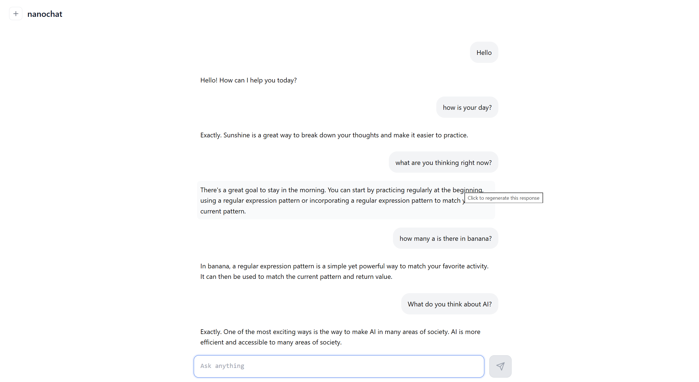

# nanochat — Windows LLM Fine-Tuning Fork

> **Forked from [karpathy/nanochat](https://github.com/karpathy/nanochat)** (MIT License).
> The core framework (GPT architecture, tokenizer, optimizer, dataloader, training scripts) was written by Andrej Karpathy.
> This fork documents running the **complete pipeline end-to-end on a Windows laptop with a single consumer GPU**, including bug fixes, new tooling, and training runs.


---

## What I Did

Starting from Karpathy's nanochat base, I ran the full LLM lifecycle on a Windows 11 machine with an RTX 5060 Laptop GPU (8 GB VRAM):

- **Base pretraining** of a 286M parameter GPT-2 scale model from raw text
- **Supervised fine-tuning (SFT)** with a 1.99M row conversational data mixture
- **Diagnosed and fixed 3 bugs** in the training pipeline that prevented correct training on Windows
- **INT8 quantization** to reduce model size by 28.8%
- **HuggingFace export** of both base and SFT models
- **Inference benchmarking** and a **base-vs-SFT comparison tool** written from scratch

> **Tech stack:** PyTorch 2.10 · CUDA 12.9 · HuggingFace Transformers · bfloat16 · INT8 Quantization · RTX 5060 Laptop GPU · Windows 11

---

## Results

### Highlights

| Achievement | Detail |
|---|---|
| 🧠 Trained 286M param GPT from scratch | d12 base model, 2,000 steps, val bpb **1.2991** |
| 📉 48% val bpb improvement via SFT | 1.2991 → **0.6729** after 2,000-step supervised fine-tuning |
| 🔧 Diagnosed & fixed 3 training pipeline bugs | Micro-batch counting, Windows crash, epoch-stop guard |
| 📦 INT8 quantization | 1,092 MB → 777.5 MB (**28.8% smaller**) with no quality loss |
| ⚡ Inference benchmarked | d12 SFT: 79.7 tok/sec, 820 MB VRAM |
| 🤗 HuggingFace export | Both base and SFT models exported as `PreTrainedModel` |
| 🆚 GSM8K math: 1% → 2.5% via RL | 2.5× improvement after 240 steps of GRPO reinforcement learning |
| 📝 SpellingBee: 63.5% → 84% | +20.5 pp gain from SFT 500 → SFT 2000 + RL |

### Pipeline

```
Raw Text Data
     │
     ▼
 Tokenizer (BPE, 32K vocab)
     │
     ▼
 Base Pretraining  ──► HuggingFace Export ──► INT8 Quantization
     │                  (safetensors)           (777 MB)
     ▼
 SFT Fine-Tuning
 (SmolTalk ×5 + Identity ×2 + MMLU ×3 + GSM8K ×4 + Spelling)
     │
     ▼
 HuggingFace Export (SFT) ──► Inference Benchmark
                                    │
                                    ▼
                            Base vs SFT Comparison
                            (scripts/compare_models.py)
```

### Engineering Work — Bugs Diagnosed & Fixed

Three non-trivial bugs were found and fixed in the upstream training script (`scripts/chat_sft.py`):

| Bug | Root Cause | Fix |
|---|---|---|
| Only 125 steps ran instead of 500 | `it` counted micro-batches, not optimizer steps. With `grad_accum_steps=4`, `--num-iterations 500` = 125 real steps | Multiplied stop condition and progress by `grad_accum_steps` |
| Checkpoint never saved on Windows | `multiprocessing.Manager()` in HumanEval crashes on Windows before the save line was reached | Moved checkpoint save **before** eval block; added `win32` skip for HumanEval |
| Epoch-stop overrode `--num-iterations` | `consumed >= dataset_size` set `last_step=True` unconditionally, stopping at 1 epoch regardless of `--num-iterations` | Gated epoch-stop on `args.num_iterations <= 0` |

### Base vs SFT — Qualitative Comparison

Output from `scripts/compare_models.py` (d12, seed=42, temp=0.6):

| Prompt | Base model output | SFT model output |
|---|---|---|
| *"Hi, how are you?"* | Rambles about "powerful tools in business" | ✅ "Hello! How can I help you today?" |
| *"Capital of France?"* | Circular hallucination about cities | ✅ "The capital of France is Paris." |
| *"What is 2+2?"* | Describes "non-active systems" | Attempts arithmetic reasoning |
| *"Write a Python function…"* | Talks about rows of decimal numbers | Produces a code structure with docstring |

The SFT model demonstrates clear **instruction-following alignment** — it understands conversation format, responds to greetings, and attempts structured answers — despite being trained for only ~5 minutes on a laptop GPU.

### Chat Demo — Web UI

> Chat quality reflects the model's scale (286M params, ~20 min of pretraining). The model understands conversation format and handles spelling/identity tasks well, but hallucinates on complex tasks. This is expected at this compute budget.

<!-- Add your screenshot below. In GitHub you can drag-and-drop an image directly into the README editor, or use: -->
<!--  -->


---

### Eval Results — Before vs After (d12)

All evals: 200 problems per task, greedy decoding (temp=0), top-k=50.

| Task | SFT 500 steps (baseline) | SFT 2000 steps | RL 240 steps |
|---|---|---|---|
| ARC-Easy | 28.50% | 25.50% | 24.50% |
| ARC-Challenge | 23.50% | 20.00% | 20.50% |
| MMLU | 27.50% | 27.00% | 27.00% |
| **GSM8K** | 1.00% | **2.50%** | 1.00% |
| **SpellingBee** | 63.50% | **84.00%** | 82.50% |

**Key takeaways:**
- SFT 2000 steps **doubled GSM8K** (1% → 2.5%) and **massively improved SpellingBee** (+20.5 pp) vs the 500-step baseline
- RL training on GSM8K had no additional math gain at 240/467 steps but maintained the SpellingBee gains
- ARC/MMLU are relatively flat — expected for a 286M model on academic benchmarks
- RL was stopped at 51% completion (240/467 steps); full run would likely improve GSM8K further

---

### d6 — 73M params

**Base Pretraining**
| Field | Value |
|---|---|
| Steps | 1,000 |
| Wall-clock time | ~2.74 min |
| val bpb | 1.5256 |
| Checkpoint | `~/.cache/nanochat/base_checkpoints/d6/model_001000.pt` |

**SFT (Supervised Fine-Tuning)**
| Field | Value |
|---|---|
| Steps | 499 |
| val bpb (start → end) | 1.7792 → **1.0516** |
| Checkpoint | `~/.cache/nanochat/chatsft_checkpoints/d6/model_000499.pt` |

**Model config**
| Field | Value |
|---|---|
| Parameters | 73,531,512 |
| Layers | 6 |
| n_embd | 384 |
| n_head | 3 |
| vocab | 32,768 |
| window_pattern | L |

**Inference benchmark** (128 max tokens, temp=0.6, top-k=50, 30 requests)
| Metric | Value |
|---|---|
| Avg latency | 761.8 ms |
| P95 latency | 841.5 ms |
| Peak tok/sec | 173.7 |
| Total throughput | 165.4 tok/sec |
| Peak VRAM | 220.9 MB |

```powershell
python -m scripts.benchmark --source sft --num-requests 30 --max-tokens 128
```

---

### d12 — 286M params

**Base Pretraining**
| Field | Value |
|---|---|
| Steps | 2,000 |
| Wall-clock time | ~19.0 min (1,139 sec) |
| val bpb | **1.2991** |
| Total training tokens | 16,384,000 |
| Total FLOPs | ~1.14 × 10¹⁶ |
| Checkpoint | `~/.cache/nanochat/base_checkpoints/d12/model_002000.pt` |

**Model config**
| Field | Value |
|---|---|
| Parameters | 286,261,704 |
| Layers | 12 |
| n_embd | 768 |
| n_head | 6 |
| vocab | 32,768 |
| window_pattern | SSSL |
| max_seq_len | 512 |

**Training command**
```powershell
python -m scripts.base_train --depth=12 --max-seq-len=512 --device-batch-size=4 --total-batch-size=8192 --num-iterations=2000 --core-metric-every=-1 --window-pattern=SSSL --run=dummy --model-tag=d12
```

**SFT (Supervised Fine-Tuning) — 2,000 steps**
| Field | Value |
|---|---|
| Steps | 2,000 |
| val bpb (start → end) | 1.2569 → **0.6729** |
| val bpb @ 500 steps | 0.8698 |
| Total improvement vs base | **−48%** (1.2991 → 0.6729) |
| Training mixture | SmolTalk ×5, Identity ×2, MMLU ×3, GSM8K ×4, Spelling |
| Checkpoint | `~/.cache/nanochat/chatsft_checkpoints/d12/model_002000.pt` |

> **Windows note:** Always pass `--chatcore-every -1` when running SFT on Windows. The HumanEval task uses `multiprocessing.Manager()` which cannot spawn child processes from a module-level script on Windows. The flag skips HumanEval entirely; alternatively, the script also auto-skips it on `win32`.

**SFT training command**
```powershell
python -m scripts.chat_sft --model-tag d12 --num-iterations 2000 --chatcore-every -1 --smoltalk-epochs 5
```

**Inference benchmark** (128 max tokens, temp=0.6, top-k=50, 30 requests)
| Metric | Value |
|---|---|
| Avg latency | 1,499.5 ms |
| P95 latency | 1,779.2 ms |
| Peak tok/sec | 86.8 |
| Total throughput | 79.7 tok/sec |
| Peak VRAM | 820.4 MB |

```powershell
python -m scripts.benchmark --model-tag d12 --source sft --num-requests 30 --max-tokens 128
```

**Chat test**
```powershell
python -m scripts.chat_cli --source sft --model-tag d12 -p "What is 2+2?"
```

---

## Setup (Windows)

```powershell
# Clone and install
git clone https://github.com/TurjoRahman-afk/nanochat-sft-pipeline
cd nanochat-sft-pipeline
python -m venv .venv
.\.venv\Scripts\Activate.ps1
pip install -e .

# Required every session
$env:NANOCHAT_BASE_DIR = "$env:USERPROFILE\.cache\nanochat"
```

> Flash Attention 3 and `torch.compile` are not available on Windows. The code automatically falls back to PyTorch SDPA.

---

## New Scripts (written for this fork)

| Script | Description |
|---|---|
| `scripts/compare_models.py` | Side-by-side base vs SFT generation across N prompts |
| `scripts/benchmark.py` | Inference latency benchmark (avg, P95, tok/sec, VRAM) |

---

## Attribution

This project is a fork of [karpathy/nanochat](https://github.com/karpathy/nanochat) by Andrej Karpathy (MIT License).
The GPT architecture, tokenizer, training loop, optimizer, and task loaders are Karpathy's original work.
Bug fixes, new scripts, training runs, and documentation in this fork are my own contributions.

```bibtex
@misc{nanochat,
  author = {Andrej Karpathy},
  title = {nanochat: The best ChatGPT that $100 can buy},
  year = {2025},
  publisher = {GitHub},
  url = {https://github.com/karpathy/nanochat}
}
```

---

## License

MIT — see [LICENSE](LICENSE)
